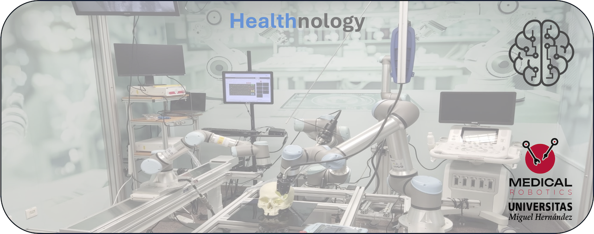

##  Welcome to the Medical Robotics Laboratory at the Miguel Hernández University of Elche
### ✨ Healthnology lovers ✨

We are part of the [nBio Biomedical Neuroengineering research group](http://nbio.umh.es) of the [Miguel Hernández University of Elche](https://www.umh.es), and we are focused on the use of technology to improve the quality of life. Investigating and developing applications that are useful for people, and that have the potential to be transferred to society, is in our DNA.

The medical robotics group is a muldisciplinary team dedicated to the development of robotic technology in the field of health and surgery. Experts in the development of wearable electronics for monitoring biometric parameters and in the application of artificial intelligence (AI) techniques for early diagnosis of pathologies and / or the improvement of quality of life of users. In the field of robotic surgery we work on the development of new intra-operative medical imaging systems, based on RF and US, for application to imaging-guided robotic surgery. 

>[!TIP]
>“True progress is that which puts technology within everyone's reach”. Henry Ford (1863-1947)

## Find us on:

# Selected group's projects (more in repositories)
**_UR3 Simulator:_**   Reference: Montenegro-Bravo, J. S., Ruiz-Flórez, J. D., Romero-Ante, J. D., Manrique-Córdoba, J., Albán, O. A. V., & Sabater-Navarro, J. M. (2024). Generador 3D de trayectorias libres de colisiones para un manipulador UR3e con pinza blanda. Revista Iberoamericana de Automática e Informática industrial, 21(1), 52-61

**_Multi UR Interfaz (UR3e+ UR5e):_**   Reference: Ángel H. Garzón-Sarzosa, Jhoan S. Sarria-Flórez, Juan D. Romero-Ante, Óscar A. Vivas-Albán, and José M. Sabater-NavarroDigital Twin of a multi-arm surgical robotic system and integration into ROS2 (2025).

**_Interfaz del proyecto RACE:_**   Reference: PID2019-111023RB-C32 Evaluación de las suturas de un sistema robótico para anastomosis. Ministerio de Ciencia e Innovación.

**_Publicación de datos a través de ROS desde Geomagic Touch (Private):_**   

